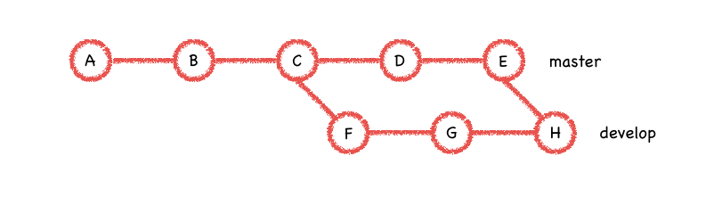
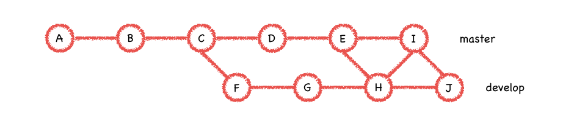

# Git使用指南

[TOC]

### 1. Git基本概念

#### 1.1 什么是版本控制系统

​	版本系统是用来追踪文件增删，更改的历史记录的工具。在软件工程中使用版本控制能更高效的对开发，测试，发布等过程进行管理。但是版本控制不局限于在开发过程中使用，还可以用来对其他的内容进行版本控制，比如你是一本畅销书的作家，你可能会需要版本控制来对你写作的内容进行管理，修订，更新。

​	使用版本控制能帮你：

* 在项目的各个版本，开发状态之间自由穿梭
* 同时由多人开发多个新功能，然后将这些工作内容集成在一起
* 只要提交过的工作内容，不用担心他会丢失


#### 1.2 为什么使用Git

​	Git作为一个“分布式版本控制系统”，每个版本库都保存了全部的历史记录，而不是仅保存了当前版本的“快照”。这种做法看似提高了磁盘的开销，但是这么做带来的好处却远大于那几百兆的磁盘空间。首先Git的设计原则里规定了，每个版本库的副本都是平等的，并没有哪个版本库客观上被特殊对待。分布式的版本控制系统的数据流动方向可以发生在任何版本库之间，比如Alice和Bob都从同一个远程仓库上获取了最新的代码，他们不仅可以在远程仓库之间推送，拉取数据。他们彼此之间的工作内容也可以直接共享，Alice完全可以把他最新的修改推送给Bob。分布式版本控制如果任何一个版本库挂掉，只要还有其他的版本库存在，工作内容就不会丢失。


#### 1.3 提交

​	提交是git中最小的操作对象，提交代表了一系列文件更改。只有做过提交，才可以把工作内容加入到版本库，git使用三个区域来管理项目里的所有文件：

* 版本库：.git/ 隐藏文件夹里的全部内容

* 暂存区（索引）：准备提交但暂未提交的内容

* 工作区：.git/ 目录之外的所有文件，开发者编写代码是在工作区进行的

> 版本库中所有的提交组成了一个“有向无环图”，称为提交图。


#### 1.4 分支

​	分支是一系列提交的集合，分支使用一个`HEAD`指针来标记最新的提交


​	比如上图develop分支里包含的所有提交有A，B，C，F，G。develop分支的HEAD为提交G，分支包含的所有提交是分支头的所有“可到达提交”。

> 可到达提交：某一个提交的“可到达提交”是该提交以及提交图中它的所有“祖先节点”。如图提交A，B，C，F为F提交的所有“可到达提交”。


```powershell
## 创建分支
$ git branch branch_name

## 检出到分支
$ git checkout branch_name

## 删除分支
$ git branch -d branch_name

## 分支重命名
$ git branch rename
```


### 2. 基础子命令

#### 2.1 初始化 `init`

​	初始化命令用于创建一个git仓库，在工作区目录执行`git init`命令之后，路径下会新增一个`.git`文件夹，里面包含了版本库最基本的信息，当你在github上点击了`New repository`后，实际上是执行了`git init --abre`命令。


#### 2.2 克隆 `clone`

​	克隆是从已经存在的版本库中“初次”拉取仓库中的所有内容到本地的过程，当你在github上点击了`fork`按钮的时候，实际上是执行了`git clone `。很多时候，克隆是在已有的项目的基础上开始工作的第一步。

>  裸仓：`git init`以及`git clone`都可以指定一个可选参数 --bare，他表示创建/克隆一个“裸仓”，“裸仓”就是指只包含版本库，不包含任何的工作区文件。

​	克隆来源的远程仓库支持很多种协议，常见的例如ssh，http(s)，ftp，甚至是file协议。可以看出这里所谓的“远程仓库”有可能只是一个本地路径。

```powershell
$ git clone ssh://git@github.com/username/repos.git

$ git clone https://github.com/username/repos.git

$ git clone file://path/to/repo/repos.git
```


#### 2.3 配置 `config`

​	 git的配置信息分为三个级别，分别是：

* system：系统配置，存储在 /ect/.gitconfig 文件中

* global：全局配置是针特定用户的配置，储存在 ~/.gitconfig 文件中

* local：每个版本库单独的配置，储存在版本库的 .git/config 文件中

  git的配置信息本质上是 ini 格式的文件，以下内容是一个gitconfig文件的示例：

```ini
[alias]
  ss = status --short
  st = status
  line = log --graph --pretty=oneline
  ch = checkout
[user]
  email = 534393806@qq.com
  name = mangonob
```

  通过`git config`命令可以方便的对配置文件进行写入，读取特定的配置，当然你也可以直接编辑配置文件：

```powershell
## 在全局配置中添加用户邮件配置
$ git config --global user.email 534393906@qq.com
  
## 在系统配置中设置vim为默认编辑器
$ git config --global core.editor vim
  
## 查看所有全局配置
$ git config --global --list
alias.ss=status --short
alias.st=status
alias.line=log --graph --pretty=oneline
alias.ch=checkout
user.email=534393806@qq.com
user.name=mangonob
```


#### 2.4 检查 `status`

​	经常使用`git status`命令来查看工作区以及暂存区的状态：

```powershell
$ git status
On branch dev
Your branch is up-to-date with 'origin/dev'.

nothing to commit, working tree clean

$ touch a.txt

$ git status
On branch dev
Your branch is up-to-date with 'origin/dev'.

Untracked files:
  (use "git add <file>..." to include in what will be committed)

	A.txt

nothing added to commit but untracked files present (use "git add" to track)

## 将未追踪的文件A.txt加入到版本库
$ git add .

$ git status
On branch dev
Your branch is up-to-date with 'origin/dev'.

Changes to be committed:
  (use "git reset HEAD <file>..." to unstage)

	new file:   A.txt

$ echo A >> A.txt

$ git status
On branch dev
Your branch is up-to-date with 'origin/dev'.

Changes to be committed:
  (use "git reset HEAD <file>..." to unstage)

	new file:   A.txt

Changes not staged for commit:
  (use "git add <file>..." to update what will be committed)
  (use "git checkout -- <file>..." to discard changes in working directory)

	modified:   A.txt

## 将对A.txt的更改添加到暂存区，然后提交
$ git add . && git commit -m "Add and modify A.txt"
```

​	首先在一个干净的工作区下执行`git status`会得到git的提示，向你说明工作区是干净的，没有什么需要提交的。

​	然后这里新建一个 A.txt 文件，这时执行`git status`就会被告知工作区下有未追踪的文件，git会人性化的建议你使用`git add`命令将它加到暂存区，照做之后，再次执行`git status`显示有一个新的文件 A.txt 是“将要提交的变更“。

​	追加一行文本到 A.txt 之后，执行`git status`，发现除了刚才提示的新文件 A.txt 之外还提示了对 A.txt 的修改是”未暂存的更改“。git同样给出了两个建议的命令，通过`git add`来将更改添加到暂存，或者使用`git checkout -- <file>`来撤销工作区的更改。这里选择添加，并提交，每次提交完成之后工作区就会恢复到干净的状态。

​	检查命令有一个“简短模式”，只查看工作区以及暂存区的状态，而忽略其他的输出信息。

```powershell
## 创建一个新文件
$ touch temp.file

$ git status --short
?? A

$ git add .

$ git status
A  temp.file

$ echo "new line" >> temp.file

$ git status
AM temp.file

## 一次性提交工作区以及缓存区的更改
$ git commit -a -m "some modify"

$ mv temp.file new.file

$ git status --short
R  temp.file -> new.file
```

​	执行`git status --short`的输出格式很简短，每一行的前两个（列）字符分别描述了文件在暂存区以及工作区的状态。当新建一个文件 temp.file 时，这时新文件没有被加入到暂存区，对于git而言这个文件是“未追踪的”，git不会干涉未追踪的文件；执行`git add .`之后将 temp.file 加入到暂存区之后，会发现状态输出的第一列变为A，表示新建文件（Add）；对 temp.file 进行修改之后，状态输出的第二列变为M，表示工作区有新的修改（Modify）；把这些更改都提交到版本库之后，对文件进行一次重命名，再次查看状态输出，第一列变为R，表示文件被重命名（Rename）。


#### 2.5 添加 `add`

​	添加操作是将工作区的变更加入到暂存区，以便下一次提交，暂存区可以让你将阶段性的工作保存下来，继续在工作区中进行开发，而不必做出提交操作，这样既可以减少不必要的提交次数，又能将暂时需要保存的内容（暂存区中）和可能需要随时撤销的内容（工作区中）分开存放。`git add`命令的常用形式为 `git add <pathspec>`

```powershell
## 单独添加文件或文件夹（<pathspec>与标准的ls命令兼容）
$ git add README.md

## 一次性添加整个工作区
$ git add .
```


#### 2.6 提交 `commit`

​	提交操作是使用git的时候最频繁使到的操作之一，每次工作到了一个阶段，完成一个新功能之后都是进行提交的恰当时机。注意如果你需要操作，应用，或者撤销你对项目的变更，那么就必须为这些变更做一次提交。频繁提交是一个好习惯，会让你的版本库的历史记录粒度更细，更具有可操作性。

```powershell
## 使用 -m 参数指定提交信息
$ git commit -m "提交信息"

## 直接提交，git会唤起特定文本编辑器来让你添加一段文本作为提交信息
$ git commit
```

​	每个提及都有若干个父提交：

* 没有父提交：版本库的第一个提交是没有父提交的

* 一个父提交：最常见的提交

* 两个或者多个父提交：合并提交

   git会根据提交的更改内容，为提交生成一个40位数字字母的sha加密串，标识了提交的唯一性。git对提交的引用最终也都是通过提交的ID进行的。通过`git rev-parse 可以查看提交的ID`

```powershell
$ git rev-parse HEAD
8acfbc989aad1c2050464b8bb5a74a668ded8895
   
$ git rev-parse master
8acfbc989aad1c2050464b8bb5a74a668ded8895

$ git rev-parse origin/master
8acfbc989aad1c2050464b8bb5a74a668ded8895
```

​	以上是当前位于master时执行的命令以及相应的输出，可以看出本地分支的名称master，当前分支的头HEAD，远程的master分支`origin/master`实质上都代表同一个提交。


####2.7 分支 `branch`

​	分支命令`git branch`用于创建，删除，修改分支，默认执行`git branch`时会在当前分支的HEAD处创建一个分支，但不会切换到新创建的分支。如果想进行切换分支操作，需要用到检出命令。

````powershell
## 创建一个名为 develop 的分支
$ git branch develop

## 修改 develop 分支名
$ git branch -m develop develop-new

## 删除 develop 分支
$ git branch -d develop
````


#### 2.8 检出 `checkout`

​	检出操作用来在多个分支之间进行切换。

```powershell
## 切换到 develop 分支
$ git checkout develop
```

​	如果需要在创建分支的同时并切换到新分支，可以加上 -b 参数。

```powershell
## 创建并切换到 new-branch 分支，以下命令等效于 git branch new-branch && git checkout new-branch
$ git checkout -b new-branch
```

​	检出操作出了用来切换分支之外还有一个很有用的功能就是用来撤销工作区修改。

```powershell
$ cat new.file
new line

## 追加新行到 new.file
$ echo "other new line" >> new.file

$ cat new.file
new line
other new line

$ git status --short
RM temp.file -> new.file

## 撤销工作区中对 new.file 的更改
$ git checkout -- new.file

$ git status
R  temp.file -> new.file

$ cat new.file
new line
```


#### 2.9 日志 `log`

##### 2.9.1 日志命令的使用

​	日志`git log`命令通常是用来查看给定提交的所有“可到达提交”的。可以通过很多方式来指定想要查看日志的提交，比如分支名，头指针，或者直接指定提交ID。

```powershell
## 直接查看log输出内容较多，可以看到全部“可到达”提交的作者，日期，提交消息，父提交等信息

$ git log master
commit 8acfbc989aad1c2050464b8bb5a74a668ded8895 (master)
Author: mangonob <534393806@qq.com>
Date:   Thu Jul 26 20:20:34 2018 +0800

    E

commit f123a700add6d8bd00ba3ca60aac0a1579e6a609
Author: mangonob <534393806@qq.com>
Date:   Thu Jul 26 20:20:27 2018 +0800

    D
...MORE...

## 使用单行模式查看提交图
$ git log --pretty=oneline --graph master develop
* 6eea1ab3c023761208428a1dba8c36a75e6703f3 (HEAD -> develop) G
* a941a377eb2ac74e2bbd0fed0830000cc45e59f2 F
| * 8acfbc989aad1c2050464b8bb5a74a668ded8895 (master) E
| * f123a700add6d8bd00ba3ca60aac0a1579e6a609 D
|/
* e0d91cb0225590f3b3ef1699cdf053870808d7ab C
* cee45d882544d70e5b5a0a9ba086f4ef5347241a B
* 01e9b2dac3ac8a46cbca187fc20967b2c343425d A
(END)
```

##### 2.9.2 提交范围

​	提交范围的格式是`start..end`，通过指定“开始提交”以及“结束提交”来指定一个提交的范围，提交范围通常包含多个提交，要注意的是提交范围并不包含`start`，但是包含`end`。提交范围`start..end`的明确定义是：所有`end`的可到达提交，但不包含`start`的所有可到达提交。


​	比如在这张提交图中，提交范围`master..develop`包含提交F，G，提交范围`develop..master`包含提交D，E。提交范围是有着明确的实际意义的，那就是start分支中不包含的end分支上的更改，或者说是那些相对于Alice而言，Bob所做的一些“新的”提交。

​	可以使用`git log`来查看提交范围内的所有提交

```powershell
$ git log master..develop
commit 6eea1ab3c023761208428a1dba8c36a75e6703f3 (HEAD -> develop)
Author: mangonob <534393806@qq.com>
Date:   Thu Jul 26 20:20:52 2018 +0800

    G

commit a941a377eb2ac74e2bbd0fed0830000cc45e59f2
Author: mangonob <534393806@qq.com>
Date:   Thu Jul 26 20:20:44 2018 +0800

    F
(END)
```


#### 2.10 推送 `push`

​	推送是主动的将提交更新到其他的版本库的过程，推送和后面将介绍的获取是git在不同版本库之间传输数据的基本机制，也是git作为分布式版本控制系统的基本操作。通常我们会通过推送将工作内容共享给项目的其他成员，或者备份到远程服务器上的仓库中。

```powershell
## 将本地master分支的内容推送到远程仓库
$ git push origin master

## 将本地master分支的内容推送到远程仓库上，并使用强制推送
$ git push origin master -f

## 将所有本地分支推送到远程仓库
$ git push --all
```


#### 2.11 获取 `fetch`

​	获取命令`git fetch`是与推送命令`git push`相对应的命令（而不是`git pull`），可以通过获取命令来获取远程服务器上的最新提交，或者新增的分支。这些新的更改可能来自于团队中其他的成员，或者是你的另一台计算机。

```powershell
## 获取远程仓库的master分支上的最新更改
$ git fetch origin master

## 获取远程仓库所有分支的更改
$ git fetch origin --all
```


#### 2.12 合并 `merge`

##### 2.12.1 使用合并来集成分支

​	合并是将两个分支的变更集成到一起的手段，通过将他人的分支上的内容合并到自己的分支上，来获取别人开发的新特性是很常见的操作。



​	合并基础是合并的起点，合并基础代表合并的两个分支是从哪一个提交开始分开。如图为执行`git merge master`后，生成了一个合并提交H，合并发生时，git将从合并基础到并入分支头之间所有的提交纳入到当前分支，并生成一个合并提交，develop 分支以及 master 分支的合并基础为提交C，执行合并之后提交范围`C..master`内的所有提交都会加入到develop分支中，合并之后上图中的所有提交都是 develop 分支的可到达提交。

​	多人开发中不可避免的会有“冲突”发生，冲突通常发生在多人对项目进行了更改时，git可能无法根据各自分支中的提交信息进行自动合并。自动合并有时候是自然而且简单的，比如Alice添加了文件 a.txt 而Bob在自己的分支添加了文件 b.txt，git就很容易对这种情况进行合并（两个文件都保留）。但是极端的情况，如果Alice和Bob都对同一个文件的同一行进行了修改，这时git无法决策出正确的状态。这时就需要手动修正这些冲突。

```powershell
$ git checkout develop

## 合并 master 分支的内容
$ git merge master
Auto-merging text.txt
CONFLICT (content): Merge conflict in text.txt
Automatic merge failed; fix conflicts and then commit the result.

$ git status --short
UU text.txt

$ cat text.txt
A
B
C
<<<<<<< HEAD
F
G
=======
D
E
>>>>>>> master

## 更改 text.txt 文件，使之达到理想状态

## 解决冲突后提交，这时产生的提交 H 为一个合并提交
$ git add . && git commit -m "H"
```

​	这里当我们合并 master 分支的内容时，发生了冲突，git提示自动合并失败，并输出发生冲突的文件。也可以使用`git status --short`来查看当前状态，状态输出的前两列为UU，表示改文件有冲突需要手动解决。查看冲突文件 text.txt 的内容会看到三方冲突提示符`<<<<<<< HEAD`，`=======`以及`>>>>>>> master`，将两个分支单独做的修改分割开来，git这么做只是方便用户看清合并上下游分别做了什么更改，接下来怎么解决这些冲突，完全取决于你的意愿。


##### 2.12.2 两种合并退化（快进，已经是最新）

​	为什么需要合并退化？考虑以下的情况（🙅‍♂️错误的示范），在 develop 分支已经合并了 master 分支并生成合并请求 H 之后，我么再在 master 分支上合并 develop 分支，如果这时在生成合并请求 I，然后 develop 又再次合并 master 分支，生成合并请求 J，...，这样的话合并永远都不会收敛，两个分支可以一直相互合并下去。



​	git不会允许这么糟糕的事情发生，也不会创建 I 提交，这次合并会“退化”。再次从下图的 master 分支出发，合并 develop 分支时发生了什么，首先 git 会找出合并基础C，然后找出从`C..develop`的所有提交C，D，E，F，G，H，这些提交是我们需要加入到master分支中的，但是`C..master`中的所有请求C，D，E已经完全包含在`C..develop`中，这种情况称之为“快进（fast-forward）”，快进表示目标分支可到达当前分支，这时候合并退化，直接将当前分支头移动到目标分支头。


​	与快进相反的情况称为“已经是最新（already update-to-date）”，表示当前分支可到达目标分支。结果之前的合并之后，develop 以及 master 分支已经位于一处，这时无论在哪个分支上合并，都会提示“Already update-to-date”，git不会进行任何其他的操作。


#### 2.13 拉取 `pull`

​	拉取`git pull`操作从远程服务器获取最新的内容（fetch），并将远程分支的内容应用到本地分支（通过merge或者rebase）。你可以使用`git pull`完成获取和应用到本地的操作，也可以使用`git fetch`获取，然后自己使用`git merge`或`git rebase`来完成同样的功能。

```powershell
## 从远程仓库origin拉取master分支的内容到本地
$ git pull origin master

## 拉取远程仓库origin的所有内容
$ git pull origin --all

## 强制拉取远程仓库origin的所有内容
$ git pull -f origin --all
```


### 3 进阶使用

